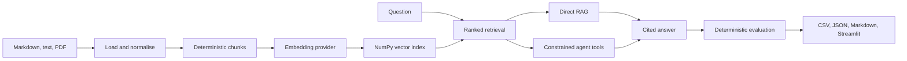

# RAG Agent Evaluation Toolkit

A lightweight Python toolkit for building, testing, and benchmarking cited
retrieval-augmented AI agents across chunking and retrieval configurations.

It turns local Markdown, text, and text-based PDF files into a transparent NumPy
index, then exposes cited direct-RAG and constrained agent paths. The project
exists as an interview-ready demonstration of the full RAG engineering loop:
ingestion, retrieval, generation, evaluation, reporting, testing, and automation.

- Run entirely offline with deterministic fake embedding and generation providers.
- Trace every answer citation back to a ranked source chunk.
- Compare four controlled chunk-size, overlap, and top-k configurations.
- Inspect the [generated sample benchmark](results/sample_benchmark_report.md).
- Stack: Python 3.11+, Typer, Pydantic, pypdf, NumPy, OpenAI SDK,
  Streamlit, pytest, Ruff, and mypy.

```powershell
rag-eval ingest --config configs/demo.yaml
rag-eval ask "What is covered under the fictional battery warranty?" --config configs/demo.yaml
rag-eval benchmark --config configs/benchmark.yaml --provider fake
```

The bundled Fictional EV Support Knowledge Base is original fictional data. This
is a portfolio-sized engineering benchmark, not a production knowledge service,
a model leaderboard, or a claim of research novelty.

## Quick start

PowerShell:

```powershell
git clone https://github.com/withoutblank/RAG-Agent-Evaluation-Toolkit.git
Set-Location RAG-Agent-Evaluation-Toolkit
python -m venv .venv
.\.venv\Scripts\Activate.ps1
python -m pip install --upgrade pip
python -m pip install -e ".[dev]"
Copy-Item .env.example .env
```

The command above installs the exact direct versions declared in
`pyproject.toml`. To reproduce the fully resolved acceptance environment, use
`python -m pip install -r requirements.lock` followed by
`python -m pip install -e . --no-deps` instead of the editable `.[dev]` install.

The offline local path makes no paid API calls:

```powershell
rag-eval ingest --config configs/demo.yaml
rag-eval doctor --config configs/demo.yaml
rag-eval ask "What is covered under the fictional battery warranty?" --config configs/demo.yaml
rag-eval agent-ask "What is covered under the fictional battery warranty?" --config configs/demo.yaml
rag-eval benchmark --config configs/benchmark.yaml --provider fake
streamlit run app.py
```

The CLI, direct-RAG path, agent path, and benchmark commands above were exercised
locally with the fake providers. To opt into an OpenAI-backed local run, set the
key only for your local session, select real model identifiers, and rebuild the
index. These commands can incur API charges and are not the source of the
committed benchmark:

```powershell
Set-Item -Path Env:OPENAI_API_KEY -Value "<your key>"
$env:RAG_PROVIDER = "openai"
$env:RAG_EMBEDDING_MODEL = "text-embedding-3-small"
$env:RAG_GENERATION_MODEL = "gpt-4.1-mini"
rag-eval ingest --config configs/demo.yaml
rag-eval ask "What is covered under the fictional battery warranty?" --config configs/demo.yaml
streamlit run app.py
```

Never commit `.env` or an API key. Remove the session key afterwards with
`Remove-Item Env:OPENAI_API_KEY`; clear the three `RAG_...` overrides and rerun
the fake-provider ingest before returning to the offline index.

## Generated benchmark

The implementation commit intentionally contains a
[benchmark placeholder](results/sample_benchmark_report.md). A follow-up commit
will replace it with the reviewed four-configuration fake-provider report
generated from this clean implementation state. This two-stage process prevents
a dirty worktree from being presented as reproducible benchmark provenance.

See the [methodology](docs/benchmark-methodology.md) for the controlled matrix,
metrics, and promotion rules.

## Architecture



External providers sit behind typed, injectable interfaces. Every stage carries
source metadata forward, and citation validation only accepts chunks actually
retrieved for that answer. Direct RAG is the benchmark default; agent planning
and its two allowlisted tools are demonstrated separately. See the
[architecture guide](docs/architecture.md).

## Evaluation methodology

- **Hit Rate@k:** share of answerable questions with any expected source in top-k.
- **MRR:** mean reciprocal rank of the first expected source.
- **Source Recall@k:** share of distinct expected sources retrieved per question.
- **Required-fact coverage:** normalised substring matches against labelled facts;
  it is a deterministic proxy, not semantic truth.
- **Citation validity/precision:** citations resolving to retrieved chunks, and
  citations whose sources match labels.
- **Unanswerable accuracy:** explicit abstention with no additional factual claim.
- **Latency:** retrieval, generation, and total wall-clock timings; fake timings
  do not represent live API performance.

Optional LLM-as-judge scoring is outside the deterministic MVP and remains
separate and disabled in CI.

## Repository map

```text
src/rag_agent_eval_toolkit/   Core ingestion, retrieval, RAG, agent, and evaluation code
sample_data/fictional_ev_support/  Eight fictional source documents
evals/                        Versioned labelled questions
configs/                      Offline demo and four-configuration benchmark
tests/                        Unit, integration, CLI, and UI tests
results/                      Reproduction guidance and curated sample report
docs/                         Architecture and benchmark methodology
.github/                      CI, security, templates, and dependency updates
```

## Design decisions

- **NumPy over a hosted vector database:** exact cosine search is transparent,
  Windows-friendly, and sufficient for this small corpus.
- **Direct RAG as the benchmark default:** it isolates retrieval and generation
  without agent-planning variance.
- **Agent mode kept separate:** it demonstrates typed tool use and trace capture
  without obscuring the controlled experiment.
- **Deterministic fake providers:** tests and the sample benchmark are repeatable,
  offline, secret-free, and cost-free.
- **Fictional data:** public-safe labels allow deliberate multi-source and
  unanswerable cases without privacy or copyright ambiguity.

## Limitations

- The corpus and evaluation set are small, fictional, and not generalisable.
- Exact NumPy search is not designed for millions of vectors or high concurrency.
- Fake-provider scores validate plumbing, not semantic model quality.
- OpenAI model output, latency, and cost can vary between runs.
- There is no fine-tuning, authentication, OCR, web crawling, multi-user storage,
  arbitrary agent code execution, or cloud deployment.

## Security and privacy

- No real customer, supplier, or personal data is included.
- API keys are runtime-only, ignored by Git, redacted from structured logs, and
  never required by tests.
- Tests and committed benchmark artifacts make no paid network calls.
- The agent exposes only `search_corpus` and `get_source_metadata`; it has no
  shell, browser, or arbitrary filesystem tool.
- The sample corpus is explicitly fictional. See [SECURITY.md](SECURITY.md).

## Development checks

```powershell
python -m pytest
python -m pytest --cov=rag_agent_eval_toolkit --cov-report=term-missing
python -m ruff check .
python -m ruff format --check .
python -m mypy src
python -m pip_audit
```

Run the combined local gate with `python scripts/check_all.py`. `pip-audit` may
need network access to refresh vulnerability data; tests themselves remain
offline.

## Roadmap

1. Hybrid lexical/vector retrieval.
2. An optional local-model provider.
3. Richer evaluation and tracing.

## Interview-ready description

An AI engineering portfolio project that implements a transparent cited-RAG
pipeline and constrained retrieval agent, then evaluates retrieval, answer,
citation, abstention, and latency behavior through reproducible offline
experiments, tests, reports, and GitHub automation.

## Author

Built by Marshall as a practical AI engineering portfolio project focused on
RAG, agent tools, evaluation, and reproducible software development.

## License

Released under the [MIT License](LICENSE).
