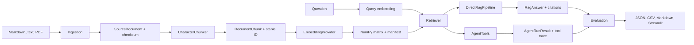

# Architecture

## Overview

The toolkit keeps the complete RAG path visible: small typed components load
documents, create stable chunks, embed them, perform exact cosine search, produce
cited answers, and evaluate controlled configurations. External providers are
injected behind protocols so tests and the sample benchmark remain offline.



`app.py` is only the Streamlit entry point. Domain behavior stays under
`src/rag_agent_eval_toolkit/`.

## Component boundaries

| Boundary | Module | Responsibility |
|---|---|---|
| Configuration | `config.py` | Validate defaults, YAML, environment values, and CLI overrides without accepting secrets from YAML |
| Document loading | `ingestion/` | Validate Markdown, text, and text-based PDF files; normalise content; preserve path, page, and checksum metadata |
| Chunking | `chunking/` | Produce deterministic character windows with stable IDs and source provenance |
| Embeddings | `embeddings/` | Provide injectable fake and OpenAI document/query embedding implementations |
| Vector storage | `index/` | Store normalised NumPy vectors, metadata, and a compatibility manifest; perform exact cosine ranking |
| Retrieval | `retrieval/` | Validate top-k and return ranked chunks with scores, source fields, excerpts, and citation labels |
| Generation | `generation/` | Provide deterministic fake and OpenAI text-generation adapters |
| Direct RAG | `rag/` | Build a context-only prompt, require abstention when evidence is insufficient, parse citations, and validate them against retrieved chunks |
| Agent | `agent/` | Expose only typed corpus-search and source-metadata tools and capture each tool call |
| Evaluation | `evaluation/` | Load strict JSONL labels and calculate retrieval, answer, citation, abstention, and latency metrics |
| Experiments | `experiments/`, `benchmarking.py` | Hold configuration constant, execute one or four runs, verify Git worktree provenance, and retain per-question outcomes |
| Reporting | `reporting/` | Generate per-run JSON, summary CSV, and Markdown reports without inventing missing metrics |
| Interfaces | `cli.py`, `ui.py` | Offer a Typer CLI and a thin one-page Streamlit review surface |

Module boundaries raise domain-specific exceptions instead of silently
discarding parsing, provider, persistence, retrieval, generation, citation, or
evaluation errors.

## Interface summary

The public flow is composed through a few narrow interfaces:

- `EmbeddingProvider` supplies `embed_documents()` and `embed_query()` plus
  model and dimension metadata.
- `GenerationProvider` supplies `generate()` and exposes its model name.
- `NumpyVectorStore` builds, searches, saves, and reloads vectors with their
  chunk metadata.
- `Retriever.retrieve()` returns ordered `RetrievalResult` records.
- `DirectRagPipeline.ask()` returns a `RagAnswer` containing answer text,
  citations, the exact evidence set, timings, model metadata, and warnings.
- `AgentTools.search_corpus()` and `AgentTools.get_source_metadata()` are the
  agent's complete tool surface.
- `execute_evaluation()` and `execute_benchmark()` compose the deterministic
  evaluation path used by the CLI.

Core records are frozen dataclasses: `SourceDocument`, `DocumentChunk`,
`IndexManifest`, `RetrievalResult`, `Citation`, `RagAnswer`, `ToolCall`,
`AgentRunResult`, `EvaluationQuestion`, `ExperimentConfig`, and
`ExperimentResult`. Public functions and provider boundaries are type checked.

## Provenance and stable identity

Ingestion normalises source content before calculating its SHA-256 digest. The
corpus checksum hashes each sorted relative path together with that document's
content checksum. Duplicate content is detected by checksum without discarding
its source identity.

A chunk ID is derived deterministically from its source and chunking inputs.
Each retrieval result carries:

- rank and similarity score;
- source ID and display name;
- optional PDF page number;
- stable chunk ID and excerpt;
- canonical citation label.

Citations use:

```text
[source_name#20-character-chunk-id]
```

A citation is valid only if its canonical label resolves to a chunk retrieved
and supplied to the generator for that answer. The answer object retains that
evidence, so report readers can audit the mapping.

## Direct RAG and agent paths

Direct RAG is the controlled benchmark path:

1. embed the question;
2. retrieve top-k chunks;
3. serialise only those chunks inside an explicit untrusted-evidence boundary;
4. generate a context-only answer or the exact insufficient-evidence response;
5. parse and validate citations;
6. return evidence and retrieval, generation, and total timings.

Agent mode demonstrates orchestration separately. It receives the question and
typed definitions for `search_corpus` and `get_source_metadata`. It has no shell,
browser, arbitrary filesystem access, or code-execution tool. Each invocation
is stored in the result trace, and the final citations pass through the same
validation rules.

## Persistence and compatibility

The local index contains a two-dimensional NumPy vector matrix plus JSON
metadata. Its manifest records:

- schema version and creation time;
- corpus checksum and document/chunk counts;
- embedding provider, model, and dimensions;
- chunk size, overlap, and normalisation method;
- artifact filenames.

Reloading validates the schema, files, dimensions, vector/chunk counts, and,
when requested, corpus compatibility. Query vectors with a different dimension
fail explicitly.

## Configuration and trust boundaries

Configuration precedence is:

1. explicit CLI overrides;
2. environment variables and local `.env`;
3. YAML;
4. safe defaults.

`OPENAI_API_KEY` is accepted only from the environment or local `.env`, never
from YAML or CLI overrides. Structured logs may include counts, durations,
non-sensitive identifiers, and error types, but not keys, authentication
headers, complete environments, or full prompts/documents in public CI.

Retrieved text is treated as untrusted evidence, not instructions. Angle
brackets are escaped before the JSON evidence is placed between prompt
boundaries. Tests inject deterministic fake providers and never require a live
API.

## Scaling limits

Exact NumPy search is deliberately appropriate only for this small local corpus.
It provides transparent similarity calculations and easy persistence without a
database service, but no approximate-nearest-neighbour index, distributed
storage, rich filtering, or concurrency controls. A measured need for millions
of chunks or sustained multi-user traffic would justify FAISS, pgvector, Qdrant,
or another purpose-selected index rather than extending this MVP implicitly.
